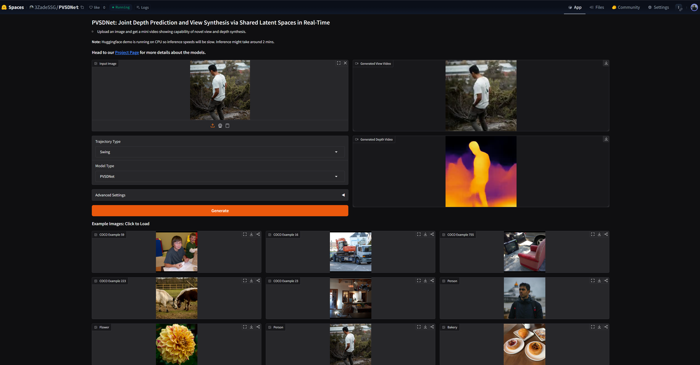
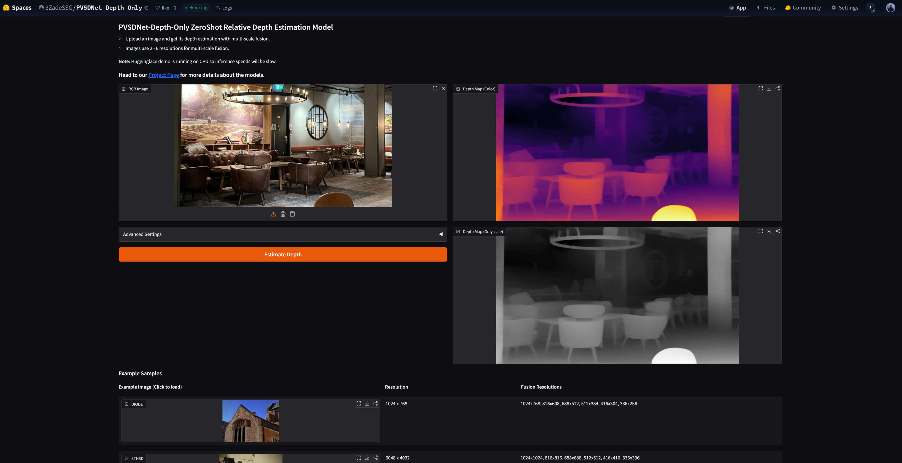

<div align="center">
<a href="https://ieeexplore.ieee.org/document/11348070"></a>
<a href='https://realistic3d-miun.github.io/PVSDNet/'></a>
<a href='https://huggingface.co/spaces/3ZadeSSG/PVSDNet-Depth-Only'></a>
<a href='https://huggingface.co/spaces/3ZadeSSG/PVSDNet'></a>
</div>
 
# PVSDNet: Joint Depth Prediction and View Synthesis via Shared Latent Spaces in Real-Time.
Real-time novel view synthesis (NVS) and depth estimation are pivotal for immersive applications, particularly in augmented telepresence. While state-of-the-art monocular depth estimation methods could be employed to predict depth maps for novel views, their independent processing of novel views often leads to temporal inconsistencies, such as flickering artifacts in depth maps. To address this, we present a unified multimodal framework that generates both novel view images and their corresponding depth maps, ensuring geometric and visual consistency.

## Supplementary Video (Head to Project Page for more visual results)
[](https://youtu.be/49s2UPvRA6I)

# Setup 
* Clone the repo and navigate into the directory
  ```bash
  git clone https://github.com/Realistic3D-MIUN/PVSDNet.git
  cd PVSDNet
  ```

* Install the basic libraries using
  ```bash
  pip install -r requirements.txt
  ```

* Download Checkpoints and place them into `./checkpoint/` directory

    | Model           | Type | Size   | Checkpoint | Resolution |
    |-----------------|--------|----------------|----------------|----------------|
    | PVSDNet  | Novel View+Depth | 1.54 GB| [Download](https://huggingface.co/3ZadeSSG/PVSDNet/resolve/main/pvsdnet_model.pth) | 256x256 |
    | PVSDNet-Lite| Novel View+Depth  | 755 MB | [Download](https://huggingface.co/3ZadeSSG/PVSDNet/resolve/main/pvsdnet_lite_model.pth) | 256x256 |
    | PVSDNet-Depth-Only  | Zero-Shot Depth Estimation | 1.11 GB| [Download](https://huggingface.co/3ZadeSSG/PVSDNet-Depth-Only/resolve/main/depth_only_model.pth) | Variable (upto 2048+) |
    | PVSDNet-Depth-Only-Lite| Zero-Shot Depth Estimation  | 279 MB | [Download](https://huggingface.co/3ZadeSSG/PVSDNet-Depth-Only/resolve/main/depth_only_lite_model.pth) | Variable (upto 2048+) |


# 1. PVSDNet - Joint Depth and View
This model predicts both the novel view and the depth map for the novel view simultaneously.

## 1.A. Gradio App (Interactive Demo)
Run the Gradio app to visualize the results in a web interface. You can generate videos with "Circle" or "Swing" trajectories.
```bash
python app_pvsdnet.py
```
The app will look like this:


## 1.B. Real-Time Inference
Run the mouse control script to interactively explore the view and depth synthesis.
* **Arguments:**
    * `--model_type`: Choose between `pvsdnet` (default) and `pvsdnet_lite`.
    * `--input_image`: Path to the input image (default: `./samples/16.jpeg`).

```bash
# For Standard Model
python renderViewAndDepthWithMouseControl.py --input_image ./samples/PVSDNet_Samples/person.jpeg

# For Lite Model
python renderViewAndDepthWithMouseControl.py --model_type pvsdnet_lite --input_image ./samples/PVSDNet_Samples/person.jpeg
```

## 1.C. Faster Inference (TensorRT)
For maximum performance, you can use TensorRT. 

1. **Build the Engine:**
   First, build the TensorRT engines for both standard and lite models.
   ```bash
   python build_trt_pvsdnet.py
   ```
   This will save engines in `./TRT_Engine/pvsdnet/`.

2. **Run Inference:**
   Run the TensorRT-optimized interactive script.
   ```bash
   # For Standard Model
   python renderViewAndDepthWithMouseControlTensorRT.py --model_type pvsdnet --input_image ./samples/PVSDNet_Samples/person.jpeg

   # For Lite Model
   python renderViewAndDepthWithMouseControlTensorRT.py --model_type pvsdnet_lite --input_image ./samples/PVSDNet_Samples/person.jpeg
   ```

## 1.D. Generate Circular Video
Generate a video traversing a circular path around the object.
```bash
python genCircularVideo.py --model_type pvsdnet --input_image ./samples/PVSDNet_Samples/person.jpeg --output_file my_video.mp4
```


# 2. PVSDNet Depth-Only Model
This model is a variant of the original PVSDNet model, where we only predict depth and not the target views. The model core is similar except the rendering network and the positional encoding are removed, hence model can be queried for variable set of resolutions.

## 2.A. Gradio App
Run the Gradio app for Zero-Shot Depth Estimation with multi-resolution fusion.
```bash
python app_depth.py
```
The app will look like this:


## 2.B. Real-Time Inference Script
Visualize depth prediction on a single image.
```bash
python renderDepthWithMouseControl.py --input_image ./samples/Wild/plant.jpeg
```

## 2.C. Faster Inference (TensorRT)
You need to setup your own TRT Engine for this purpose. 

1. Make sure you modify the `depth_only_parameters.py` to set resolution you need if different from default.

2. Create the engine directory (if not exists)
    ```bash
    mkdir TRT_Engine
    ```

3.  Run `build_trt_depth_models.py` to convert the normal pytorch models into onnx, and build TRT engine.
    ```bash
    python build_trt_depth_models.py
    ```
    The build script will save the built engines in `./TRT_Engine` directory.

4. Run `renderDepthWithMouseControlTensorRT.py` to estimate depth maps at max FPS.
    ```bash
    # Standard Model
    python renderDepthWithMouseControlTensorRT.py --model_type regular --input_image ./samples/Wild/plant.jpeg

    # Lite Model
    python renderDepthWithMouseControlTensorRT.py --model_type lite --input_image ./samples/Wild/plant.jpeg
    ```


## 2.D. Predicting on Depth Datasets using Multi-Resolution Fusion

We run the scripts inside the `depth_dataset_predictor` directory. There are two sample images for each dataset to test the code.
* First we build the TRT engine for each dataset as we use multi-resolution fusion.
    ```bash
    python depth_dataset_predictor/build_trt_<dataset_name>.py
    ```
* Then we run the prediction script
    ```bash
    python depth_dataset_predictor/predict_<dataset_name>_TensorRT.py
    ```

|Dataset|Step 1 (Build Engine)|Step 2 (Predict)|
|---|---|---|
|ETH3D| ```python depth_dataset_predictor/build_trt_ETH3D.py``` | ```python depth_dataset_predictor/predict_ETH3D_TensorRT.py```| 
|Sintel| ```python depth_dataset_predictor/build_trt_Sintel.py``` | ```python depth_dataset_predictor/predict_Sintel_TensorRT.py```|
|KITTI| ```python depth_dataset_predictor/build_trt_KITTI.py``` | ```python depth_dataset_predictor/predict_KITTI_TensorRT.py```|
|DIODE| ```python depth_dataset_predictor/build_trt_DIODE.py``` | ```python depth_dataset_predictor/predict_DIODE_TensorRT.py```|
|NYU| ```python depth_dataset_predictor/build_trt_NYU.py``` | ```python depth_dataset_predictor/predict_NYU_TensorRT.py```|


## 2.E. Predicting on 1080p In-The-Wild Images/Videos using Multi-Resolution Fusion
Similar to datasets, we can use the multi-resolution fusion to predict on 1080p In-The-Wild Images/Videos.

* First we build the trt engine 
    ```bash
    python depth_in_wild_predictor/build_trt_1080p.py
    ```
* **For Images:**
    ```bash
    python depth_in_wild_predictor/predict_1080p_TensorRT.py
    ```
* **For Videos:**
    ```bash
    python depth_in_wild_predictor/predict_video_1080p_TensorRT.py
    ```

#### Note
* For any other resolutions, you can modify the resolutions in these above scripts to suit your needs. We have kept the default resolution as 1080p for this example.
* We recommend 3-6 resolutions for best results, but you can use 1-2 smaller resolutions if working with low resolution images/videos since receptive field of the network can handle that without any issues.
